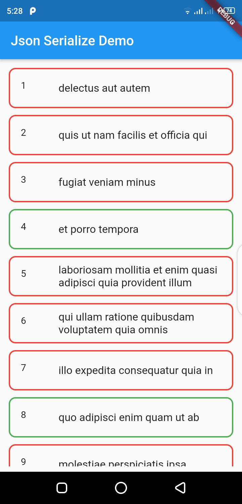

# jsonn_serialize

Flutter project to fetch data from api with JSON SERIALIZABLE.

### Project Setup

------------

You must to download the Android Studio and Flutter SDK, here we are using IntelliJ IDEA Community Edition 2020.2 x64 everything is same instead of using VScode we are IntelliJ IDEA.

- For Setup this project you follow official documentation here is the link [Flutter Official Doc](https://flutter.dev/docs/get-started/install "Flutter Official Doc").

- After successfully installation of all required software and plugins you have clone this project and open this project on whichever IDE you use & run this 2 cmd to download the dependencies in your local machine.

1) flutter pub get
2) flutter pub run build_runner build --delete-conflicting-outputs

### Screenshot 

